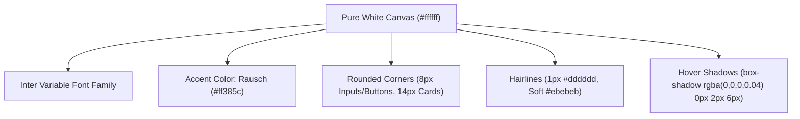
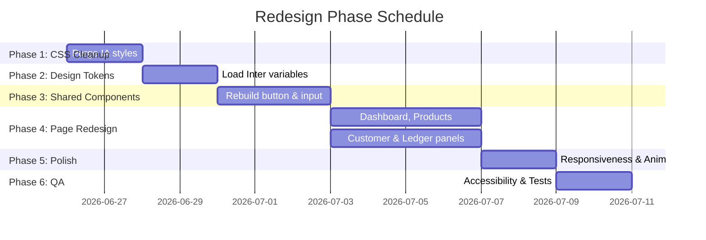

# UI Redesign Plan: Vendara Admin MVP

This document details the blueprint for migrating the Vendara sari-sari store pricelist and customer ledger system from the custom **Industrial Atelier** visual language (orange/brown theme, sharp radii, double-bezel cards) to a clean, calm, **Airbnb-inspired** design system tailored for **admin-only** desktop and mobile workflows.

---

## 1. Current UI Cleanup Strategy

To transition the visual aesthetic and product direction successfully, we must systematically purge old visual tokens, custom classes, and client-facing routes without breaking existing data pipelines or serverless backend features.

### A. CSS & Token Removal
In [global.css](file:///k:/vendara/src/styles/global.css), the following variables and utilities must be deleted:
*   **Color Variables**: Remove all `--ia-*` variables (e.g. `--ia-primary`, `--ia-surface`, `--ia-outline`).
*   **Shadows**: Delete custom shadows (`--shadow-card`, `--shadow-elevated`, `--shadow-focus`).
*   **Radii**: Replace the sharp scale (`--radius-sm: 4px` through `--radius-4xl: 24px`) with the rounded Airbnb scale.
*   **Layout & Bezel Classes**: Delete `.ia-bezel-outer`, `.ia-bezel-inner`, `.ia-well`, `.ia-label`, `.ia-split-pane`, `.ia-toolbar`, and `.ia-avatar` utility classes.
*   **Motion Utilities**: Remove transition spring classes like `.ia-spring` and `.ia-spring-hover`.

### B. Public / Customer UI Removal
*   **Root Route Cleanup**: Edit [index.astro](file:///k:/vendara/src/pages/index.astro) to remove references to the customer catalog. It will serve as a secure gateway redirecting to `/admin` or rendering the admin login screen directly.
*   **Component Deletion**: Mark [PublicCatalog.tsx](file:///k:/vendara/src/components/app/PublicCatalog.tsx) for deletion. Remove customer-focused asset dependencies.
*   **Copy Cleanup**: Erase all client-facing instructions, market taglines, and public pricing descriptors. 

### C. Admin Core Preservation
We will preserve the exact functional behaviors, event handlers, and data structures within:
*   [AdminConsole.tsx](file:///k:/vendara/src/components/app/AdminConsole.tsx): Auth checking, logging out, stat calculations.
*   [ProductManager.tsx](file:///k:/vendara/src/components/app/ProductManager.tsx): Product CRUD forms, client validation, search/filtering, price history API integration.
*   [CustomerManager.tsx](file:///k:/vendara/src/components/app/CustomerManager.tsx): Customer CRUD forms, search/filtering, split-pane routing.
*   [CustomerLedgerPanel.tsx](file:///k:/vendara/src/components/app/CustomerLedgerPanel.tsx): Multi-product debt entries, payment entries, ledger timeline sorting, and delete functions.

### D. Workflow Integrity Safety Measures
*   Maintain the same React state signatures (`form` objects, `customers`, `products`, `ledger`, `query` variables).
*   Preserve all API helpers (`fetchJson`, `fetchAdminJson`, `authClient` sessions).
*   Isolate the redesign to visual variables, JSX tags, and styling classes. Do not alter business logic in `src/lib/` or Astro API endpoints under `src/pages/api/`.

---

## 2. New Design Direction

The redesign focuses on a clean white canvas, generous but practical spacing, soft rounded corners, and a single accent color used sparingly.



### Layout and Base Styling Guidelines

*   **Color Palette**:
    *   **Canvas (`#ffffff`)**: Background for all container cards, tables, inputs, and drawers.
    *   **Surface Soft (`#f7f7f7`)**: Main page layout background, list item headers, and disabled states.
    *   **Ink (`#222222`)**: Dominant text color for display headings, input labels, body copy, and navigation links.
    *   **Muted (`#6a6a6a`)**: Secondary text color for notes, helper texts, table headers, and status metadata.
    *   **Rausch Accent (`#ff385c`)**: Single voltage color. Used for primary CTAs (e.g. "Add product", "Post credit"), active navigation underlines, text-input focus borders, and active status indications.
    *   **Hairline Divider (`#dddddd`)**: Default 1px outline for card structures, form inputs, and outer frames.
    *   **Soft Hairline (`#ebebeb`)**: Light 1px separator inside lists and ledger rows.
*   **Typography**:
    *   Standardize the entire system on **Inter Variable** (system font fallbacks).
    *   **Display weights**: Headlines at 20px–24px, font weight 500 or 600. Avoid heavy bold headers (700+) to keep the workspace calm and clean.
    *   **Body weights**: Body text and inputs at 14px–16px, weight 400.
    *   **Numbers**: Financial data table columns use `font-variant-numeric: tabular-nums` to ensure fast scanning of currency values.
*   **Border Radius**:
    *   `8px` (rounded-sm equivalent) for interactive controls, including text inputs, select lists, textareas, and buttons.
    *   `14px` (rounded-md equivalent) for primary cards, sidebars, sheets, and dialog envelopes.
    *   `9999px` (rounded-full) for badges, user avatars, pill search indicators, and toggle inputs.
*   **Elevation & Depth**:
    *   The interface lies flat by default, separating sections via soft backgrounds and hairline borders.
    *   Apply a single elevation shadow tier **only** for floating menus, dropdown selections, active dialog panels, or elements currently hovered by a pointer:
        `box-shadow: rgba(0, 0, 0, 0.02) 0 0 0 1px, rgba(0, 0, 0, 0.04) 0 2px 6px, rgba(0, 0, 0, 0.1) 0 4px 8px`

---

## 3. Admin-Only Information Architecture

The redesigned dashboard structure consolidates operations into a focused single-page console utilizing a horizontal Top Navigation Bar with active tab routing.

### A. Navigation & Shell Layout
*   **Horizontal Header Bar**: A sticky `56px` height top nav containing:
    *   **Left**: Brand Logo (redesigned simplified red-orange rectangle with clean wordmark) + small uppercase "ADMIN" label.
    *   **Right**: Account name indicator ("Store Manager") and a subtle sign-out button.
*   **Page Workspace**: A max-width `1280px` layout centered on screen with `24px` gutter paddings (`32px` on large viewports).

```text
+-----------------------------------------------------------------------------+
|  [Logo] Vendara  [Admin]                                    [Store Staff] [x]|
+-----------------------------------------------------------------------------+
|                                                                             |
|  Workspace Operations                                                       |
|  Manage product catalog and customer outstanding balance records            |
|                                                                             |
|  +-------------------+  +-------------------+  +-------------------------+  |
|  | Products Catalog  |  | Customer Accounts |  | Total Outstanding Debt  |  |
|  | 142 items         |  | 28 Active         |  | ₱12,450.50 [Rausch Dot] |  |
|  +-------------------+  +-------------------+  +-------------------------+  |
|                                                                             |
|  [Tab: Products]  *Active Underline*          [Tab: Customers & Ledgers]    |
|                                                                             |
|  +-----------------------------------------------------------------------+  |
|  |  Active Tab Panel Content (e.g. Products grid or Customer Split Pane) |  |
|  +-----------------------------------------------------------------------+  |
+-----------------------------------------------------------------------------+
```

### B. Workspace Section Mapping
1.  **Header Metrics (KPIs)**: Three simple metrics cards aligned horizontally at desktop.
2.  **Tab Controller**:
    *   **Tab 1 (Products)**: Houses search filter, item list, and product management actions.
    *   **Tab 2 (Customers & Ledgers)**: Houses search filter, split-pane directory list, and interactive ledger panels.

---

## 4. Page-by-Page Redesign Plan

Every interface surface will be converted to the new design schema.

### A. Admin Sign-In Screen
*   **Component**: [AdminLogin.tsx](file:///k:/vendara/src/components/app/AdminLogin.tsx).
*   **Redesign Layout**: Remove the dark background split gradient. Center a single, clean login card over a soft neutral (`#f7f7f7`) page background.
*   **Elements**:
    *   Clean center brand mark (Vendara logo, 28x28px, rounded 6px).
    *   Input: 56px height password input with clear label ("Admin PIN code"). Focus border turns solid ink (`#222222`).
    *   Button: Primary accent fill button ("Access Console").
*   **States**:
    *   *Error*: Red border highlight on input, simple error banner beneath: `"Incorrect PIN code. Please try again."`

### B. Admin Dashboard Console
*   **Component**: [AdminConsole.tsx](file:///k:/vendara/src/components/app/AdminConsole.tsx).
*   **Redesign Layout**: Top page metric highlights, followed by tabbed content panels.
*   **KPI Metrics Cards**:
    *   Product Count, Customer Count, and Outstanding Debt.
    *   Flat surfaces, thin border outlines, no background gradients.
    *   If Outstanding Debt > 0, display a tiny pulsing red dot (`#ff385c`) next to the currency sum instead of colored backgrounds.

### C. Products & Pricing Tab
*   **Component**: [ProductManager.tsx](file:///k:/vendara/src/components/app/ProductManager.tsx).
*   **Redesign Layout**: Two-column layout on wide screens.
    *   **Left Column**: "Add / Edit Product" form container.
    *   **Right Column**: "Stock Inventory" search filter and data table.
*   **Form Redesign**: Stacked fields inside a clean card. Clear labels in Ink (`#222222`). Gross markup and profit margins display inside a flat gray information panel (`#f7f7f7`).
*   **Price History Logs**: When clicking price history, replace accordion entries with a clean sliding drawer (Vaul) from the right or a centered modal showing a timeline with `1px` soft lines and trending direction tags (e.g. green indicator for increased markup, grey for neutral).

### D. Customers Directory & Ledger Tab
*   **Components**: [CustomerManager.tsx](file:///k:/vendara/src/components/app/CustomerManager.tsx) & [CustomerLedgerPanel.tsx](file:///k:/vendara/src/components/app/CustomerLedgerPanel.tsx).
*   **Redesign Layout**: Responsive split-pane layout:
    *   **Pane Left (320px width)**: Scrollable customer directory. List items have a left accent line when active (using `#ff385c`) and are bordered by a `1px` soft hairline.
    *   **Pane Right (Flexible)**: Customer ledger dashboard. Displays name, note, active credit status, collapsible actions ("Log credit purchase", "Record payment"), and a transaction history log table.
*   **Transaction Actions**: Replace accordions with clean, rounded pill actions. Expanding these reveals the multi-product selector fields in a simplified list layout.
*   **Ledger Timeline**: Replace the border table with a chronological chronological timeline list. Each transaction is represented by a vertical timeline block with small icons (ShoppingBag for debt, CreditCard for payments) anchored to a left alignment line.

### E. Root Route Redirect
*   **File**: [index.astro](file:///k:/vendara/src/pages/index.astro).
*   **Logic**: Run a client-side or server-side authentication check. If authenticated, direct to `/admin`. If unauthenticated, immediately display the sign-in form. Ensure no guest catalogs or public search controls render at `/`.

---

## 5. Component System Redesign

The following details the mapping of existing components to the new design standards.

| Existing Component Class / Element | Proposed Redesign Classes & Properties | Interaction & Visual States |
| :--- | :--- | :--- |
| **`ia-bezel-outer` / `ia-bezel-inner`** | `.vn-card`: Flat background `#ffffff`, border `1px solid #dddddd`, radius `14px`. | rest: flat; hover: elevation shadow tier. |
| **`ia-well` (nested header)** | `.vn-card-header`: Borderless, padded with `16px 20px` in Ink (`#222222`) font. | rest: borderless, simple layout divider. |
| **`ia-label` (uppercase mono text)** | `.vn-label`: Font size `12px`, weight `500`, Ink text color, family `Inter Variable`. | standard text display. |
| **Primary Buttons** | `.vn-btn-primary`: Background `#ff385c`, text `#ffffff`, radius `8px`, height `40px` (dense `36px`). | rest: Rausch fill; active: slightly darker `#e00b41`; hover: subtle lift shadow. |
| **Secondary Buttons** | `.vn-btn-secondary`: Background `#ffffff`, text `#222222`, border `1px solid #222222`, radius `8px`. | rest: outlines; hover: background `#f7f7f7`. |
| **Text inputs / Select boxes** | `.vn-input`: Background `#ffffff`, border `1px solid #dddddd`, radius `8px`, padding `12px 14px`, height `48px`. | focus: border `2px solid #222222` (no outline ring); error: border `2px solid #c13515`. |
| **Data Tables** | `.vn-table`: Flat table rows, header row background `#f7f7f7` with Muted text color, row lines `1px solid #ebebeb`. | rest: clean lines; hover row: background `#fafafa`. |
| **Status Badges** | `.vn-badge`: Font size `11px`, weight `600`, radius `9999px`, padding `4px 10px`. | **rose**: outstanding debts; **emerald**: settled balances. |
| **Timeline Indicators** | `.vn-timeline-node`: Small circular dot (`10px` size) on a vertical `1px` timeline grid line. | **rose fill**: purchases; **emerald fill**: payments. |

---

## 6. Responsive Design Plan

The admin panel must work perfectly on both mobile screens (store-owner staff checking balances while walking the counter) and large desktop monitors.

### A. Breakpoints and Adaptive Columns
*   **Desktop (>= 1024px)**: Full split-pane customer dashboard. Left pane lists directory; right pane hosts active ledger. Add-item forms open side-by-side in double columns.
*   **Tablet (768px - 1023px)**: Left pane collapses to a slide-out drawer (sheet) toggled by a directory header button. Right pane displays the selected ledger profile.
*   **Mobile (< 768px)**: Toggle between directory view and ledger detail view:
    *   Clicking a customer in the list slides in the ledger panel, hiding the directory list. A prominent "Back" arrow button returns to the list.
    *   KPI cards stack in a single column or collapse to a swipeable horizontal metrics carousel.
    *   Form buttons (e.g. Add Product) shift to full-width targets.

### B. Mobile Touch and Usability
*   All interactive buttons, input select boxes, and list items must have a minimum touch target area of `44px x 44px`.
*   Prevent iOS safari auto-zoom on inputs by ensuring input text utilizes a minimum size of `16px` on mobile viewports.
*   Make ledger timeline actions (e.g. Delete entry) accessible via inline buttons rather than hover controls.

---

## 7. Accessibility Improvements (WCAG 2.2 AA)

1.  **Color Contrast**: All text elements (Ink and Muted variables) must maintain a minimum contrast ratio of `4.5:1` against white canvas and soft gray backgrounds. Accent Rausch text must not be used on light backgrounds for running copy.
2.  **Focus States**: Keep focus indicator rings highly visible. On inputs, focus applies a `2px` solid black border. Buttons use a clear Rausch outline ring on keyboard focus.
3.  **Semantic Elements**: Mark all table headers with `scope="col"`. Input fields must link directly to labels using `htmlFor` properties.
4.  **Aria Roles**: Drawers and dialog panels (e.g. Price History Drawer) must feature `aria-modal="true"`, proper titles, and keyboard escape closures.
5.  **Interactive Elements**: Set `aria-pressed` states on the Products/Customers tab triggers to reflect visual active selections.

---

## 8. Design Tokens System

We will configure the following custom CSS properties in [global.css](file:///k:/vendara/src/styles/global.css):

```css
@theme inline {
  /* Fonts */
  --font-sans: 'Inter Variable', 'Inter', system-ui, -apple-system, sans-serif;
  --font-heading: 'Inter Variable', 'Inter', system-ui, -apple-system, sans-serif;
  
  /* Borders and Radii */
  --radius-sm: 8px;
  --radius-md: 14px;
  --radius-lg: 20px;
  --radius-full: 9999px;
  
  /* Spacing Scale */
  --spacing-xs: 4px;
  --spacing-sm: 8px;
  --spacing-md: 12px;
  --spacing-base: 16px;
  --spacing-lg: 24px;
  --spacing-xl: 32px;
  --spacing-section: 64px;

  /* Brand Colors */
  --color-canvas: #ffffff;
  --color-background: #f7f7f7;
  --color-surface-soft: #f7f7f7;
  --color-surface-card: #ffffff;
  --color-surface-strong: #f2f2f2;
  
  /* Semantic Accents */
  --color-primary: #ff385c;
  --color-primary-hover: #e00b41;
  --color-primary-disabled: #ffd1da;
  
  /* Text & Outlines */
  --color-ink: #222222;
  --color-body: #3f3f3f;
  --color-muted: #6a6a6a;
  --color-hairline: #dddddd;
  --color-hairline-soft: #ebebeb;
}
```

---

## 9. Developer Implementation Roadmap

The UI redesign will execute in six planned phases.



### Phase 1: CSS Cleanup & Public Route Purge
*   **Goal**: Strip the Industrial Atelier styles and secure the root route.
*   **Tasks**:
    *   Clean up `global.css` theme variables and custom class list.
    *   Modify `src/pages/index.astro` to perform session check and route directly to `/admin`.
    *   Remove `PublicCatalog.tsx` from imports.
*   **Affected Files**: [global.css](file:///k:/vendara/src/styles/global.css), [index.astro](file:///k:/vendara/src/pages/index.astro), [PublicCatalog.tsx](file:///k:/vendara/src/components/app/PublicCatalog.tsx).
*   **Acceptance Criteria**: Running the dev build compiles with no remaining `ia-*` class uses on layout margins. `/` immediately forwards to `/admin`.

### Phase 2: Design Tokens Setup
*   **Goal**: Define Airbnb-inspired global parameters.
*   **Tasks**:
    *   Set up new `@theme inline` variables in `global.css`.
    *   Verify Inter variable font load speeds.
*   **Affected Files**: [global.css](file:///k:/vendara/src/styles/global.css).
*   **Acceptance Criteria**: Text compiles using Inter Variable fonts; canvas exhibits neutral `#f7f7f7` background.

### Phase 3: Core Shared Components Rebuild
*   **Goal**: Standardize inputs, buttons, and metrics elements.
*   **Tasks**:
    *   Rebuild `components/ui/button.tsx`, `components/ui/input.tsx`, `components/ui/badge.tsx` with clean radii and accent borders.
    *   Rebuild `AppTopBar.tsx` layout.
*   **Affected Files**: `src/components/ui/` definitions, [AppTopBar.tsx](file:///k:/vendara/src/components/app/AppTopBar.tsx).
*   **Acceptance Criteria**: Shared form headers, inputs, and buttons display consistent Airbnb-style radii and color themes.

### Phase 4: Admin Page Redesigns
*   **Goal**: Complete layout refactoring for Products and Customers.
*   **Tasks**:
    *   Rewrite JSX markup in [AdminConsole.tsx](file:///k:/vendara/src/components/app/AdminConsole.tsx) to match metric structures.
    *   Rebuild [ProductManager.tsx](file:///k:/vendara/src/components/app/ProductManager.tsx) data tables and price history timeline.
    *   Rebuild [CustomerManager.tsx](file:///k:/vendara/src/components/app/CustomerManager.tsx) splits and [CustomerLedgerPanel.tsx](file:///k:/vendara/src/components/app/CustomerLedgerPanel.tsx) transaction timelines.
*   **Affected Files**: [AdminConsole.tsx](file:///k:/vendara/src/components/app/AdminConsole.tsx), [ProductManager.tsx](file:///k:/vendara/src/components/app/ProductManager.tsx), [CustomerManager.tsx](file:///k:/vendara/src/components/app/CustomerManager.tsx), [CustomerLedgerPanel.tsx](file:///k:/vendara/src/components/app/CustomerLedgerPanel.tsx).
*   **Acceptance Criteria**: The catalog manager and directory splits load without double borders; forms utilize clean inputs; list layouts look polished.

### Phase 5: Responsive Refinements
*   **Goal**: Finalize tablet and mobile view overrides.
*   **Tasks**:
    *   Apply responsive column shifts and detail pane overlays.
    *   Validate button dimensions on touchscreen emulation.
*   **Affected Files**: `src/components/app/` managers.
*   **Acceptance Criteria**: Ledger panel adapts cleanly on mobile widths (`<768px`) with back arrows and drawer indicators.

### Phase 6: Accessibility Audit & Quality Assurance
*   **Goal**: Achieve strict accessibility compliance and stable builds.
*   **Tasks**:
    *   Audit color contrasts.
    *   Verify keyboard focus highlights.
    *   Run test sweeps.
*   **Affected Files**: Codebase-wide.
*   **Acceptance Criteria**: System passes screen-reader navigation focus. Running `npm run build` executes successfully.

---

## 10. Success Acceptance Criteria

The final implementation of the redesign plan will be considered complete when:
1.  **Strict Admin-Only Scope**: The public product search is removed. The root URL `/` is secured behind administrative session controls.
2.  **Visual Language Shift**: Every button, input, card, and layout element utilizes the new clean white canvas metrics and soft corners. All `ia-*` classes are removed.
3.  **Single Brand Accent**: Airbnb Rausch color `#ff385c` serves as the sole CTA highlight color across forms and buttons.
4.  **Full Feature Support**: Product management, price logging history drawers, split-pane customer directories, ledger statements, and transaction histories remain functional.
5.  **Multi-device Responsiveness**: The workspace scales down gracefully to small screens with touch targets exceeding `44px`.
6.  **Accessibility (WCAG 2.2 AA)**: Contrast ratios exceed `4.5:1` and inputs are explicitly labeled.
7.  **Build Verification**: Running `npm run build` and `npm run test` executes successfully.
